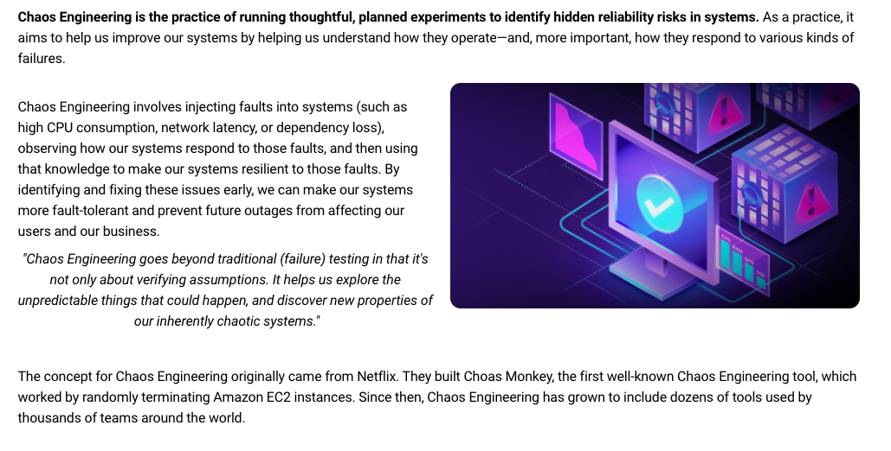
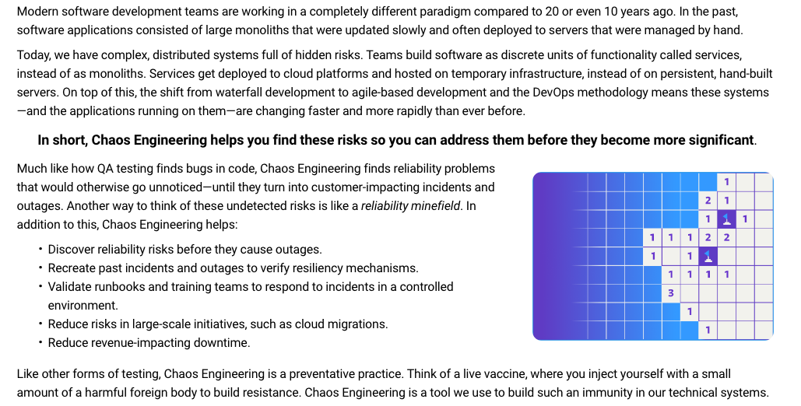
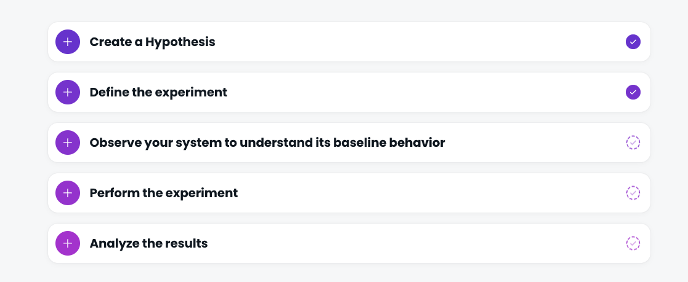
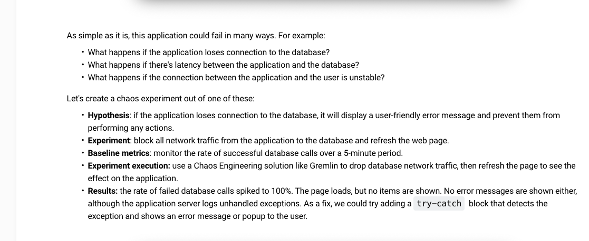
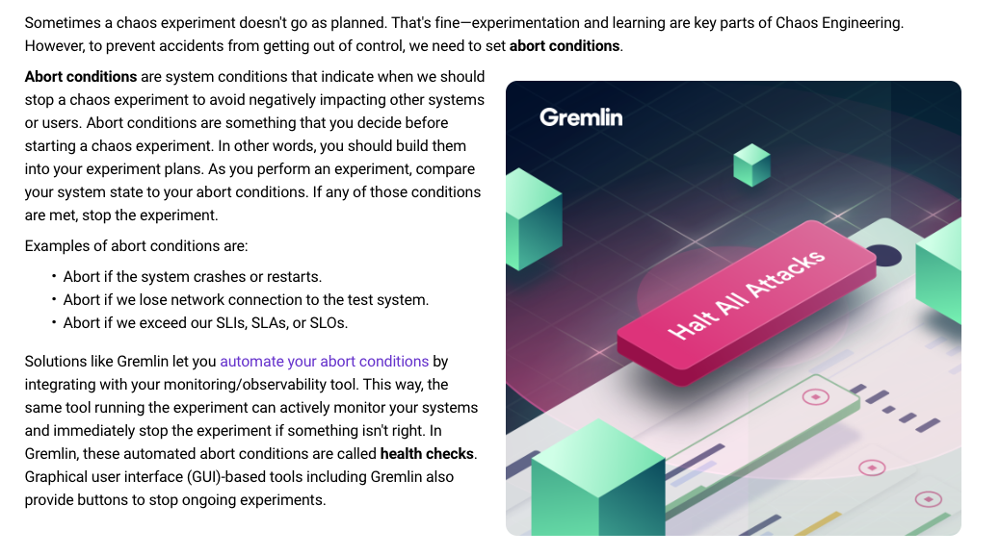
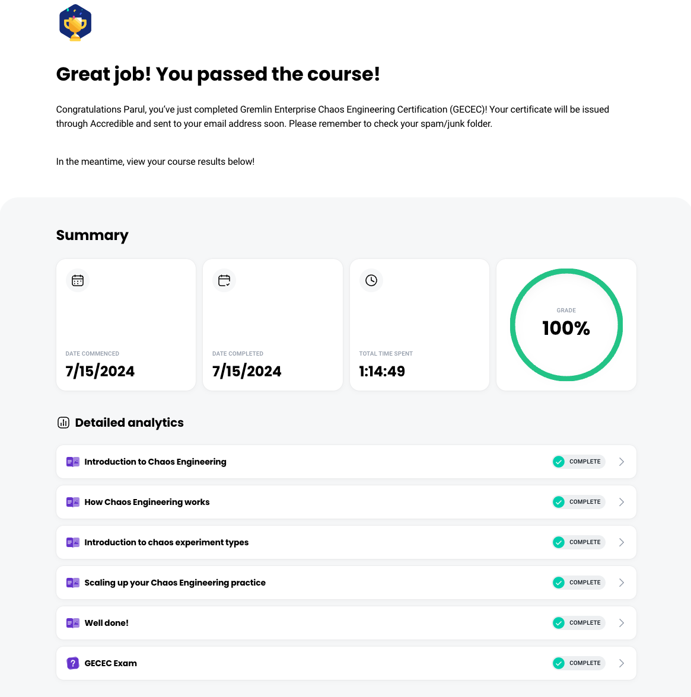

# Chaos Engineering 

## Gremlin Enterprise Chaos Engineering Certification (GECEC)

## Introduction 
### Introduction to chaos engineering

### Why Chaos Engineering is necessary

## How Chaos Engineering Works
Teams perform Chaos Engineering by methodically injecting fault into their systems. Fault injection is a technique for causing an intentional failure in a computing component, such as a host, container, or service.
Naturally, causing a failure on a system comes with risks. This is why we use Chaos Engineering experiments (or chaos experiments) to structure fault injection.
In this module, you'll learn how chaos experiments are designed and performed.

### Steps to running a successful experiment

### Setting abort conditions

## Introduction to Chaos Experiment types

### Gremlin Experiment
Different Chaos Engineering tools provide different types of faults that you can inject. For this course, well look at the twelve that Gremlin provides. Gremlin organizes its faults into three categories: State, Resource, and Network.

#### State
State experiments change an aspect of a system's state, such as its system clock or whether it's running. They include:
* **Shutdown**: Shuts down (and optionally reboots) the host operating system.
* **Time Travel**: Changes the host's system time.
* **Process Killer**: Kills the specified processes) on the host.

#### Resource
Resource experiments consume available resources, including CPU, RAM, and storage capacity. They include:
* **CPU**: Generates high load for one or more CPU cores.
* **Memory**: Allocates a specific amount of RAM.
* **IO**: Puts read/write pressure on 1/0 devices such as hard disks.
* **Disk**: Fills storage to a specific percentage by writing temporary files.

#### Network
Network experiments change the system's network behavior, such as introducing latency or blocking connections to dependencies
They include:
* **Blackhole**: Drops all matching network traffic.
* **Latency**: Injects latency into all matching outbound traffic.
* **Packet** Loss: Induces packet loss into all matching outbound traffic.
* **DNS**: Blocks access to DNS servers.
* **Certificate Expiry**: Checks for expiring TLS certificates.

### Experiment Customization
#### Target selection
Each experiment starts with selecting the systems to impact. Gremlin lets you fine-tune your selection to specific hosts, containers,
Kubernetes resources, and applications.

#### Defining your experiment's parameters
After you've selected your target systems, select and configure your experiment. In Gremlin, this means choosing an experiment from one of the three main categories (Resource, State, and Network), then entering details like experiment length, latency amount, and what network traffic to impact.

### Introduction to Scenarios
Running one-off chaos experiments is useful for small-scale tests and easing into your Chaos Engineering practice. But to run more advanced, complex, and realistic experiments, we need a way to run multiple experiments sequentially. This workflow of sequential experiments is called a Scenario. Scenarios let teams:
* Test your systems against common failure modes.
* Simulate complex failure modes, like cascading outages.
* Reproduce past incidents that you, your team, or another team has had to respond to.
Gremlin Scenarios also support Health Checks, which are automated checks that periodically check an endpoint (such as an observability tool monitor, alert, or URL) and halt the Scenario if the endpoint indicates that the system is unhealthy. Earlier in this course, we explained why it's important to have abort conditions. Health Checks are the mechanism that lets you automate abort conditions so that tests halt automatically in case of a problem, ensuring that your systems can recover quickly.
### Introduction to Game Days
Many of the Chaos Engineering concepts we've covered so far can be done individually. However, one of the most effective ways to introduce teams to Chaos Engineering is by having them run experiments, analyze the results, and determine next steps as a team. This means getting an entire team together (e.g., in a conference room or teleconferencing meeting), running one or more experiments or Scenarios, and discussing the outcomes in real-time. This is called a GameDay.
When we say "team, we don't mean an entire Engineering department. Rather, we're referring to DevOps and engineering teams, preferably teams responsible for managing specific systems or services. For example, a bank may have different teams who manage services for user authentication, security, transaction processing, etc. Each of these teams may have unique development processes, reliability requirements, and stakeholders. By taking part in GameDays, each team member better understands their reliability posture and the work they need to do to make their service(s) more resilient.
GameDays are important for several reasons:
* They test your systems against failure modes that could cause outages.
* They're great team building exercises.
* They encourage team members to share their ideas and learnings about how the system operates.
GameDays are most often organized and led by a team lead, but everyone on the team takes part in them.

### Automating Chaos Experiment
Chaos experiments and Scenarios have one thing in common: they require someone to set them up and configure them each time they're run.
This is great if you already know what it is you want to test and how to configure your tool to test it, but it's not as useful if:
* You're not sure what the risks are in your systems.
* You're not sure which systems to test first.
* You want to automate and scale experiments across many (e.g. dozens, hundreds, or thousands) systems.
This is where reliability tests help. A reliability test is a test that validates system reliability by injecting fault and uses health checks to determine a clear pass/fail criteria.
Like experiments and Scenarios, reliability tests use fault injection as the underlying mechanism. In Gremlin, reliability tests are automatically generated for each service you define in Gremlin. This has several benefits:
* It standardizes reliability testing across many services.
* It makes onboarding new teams much easier by giving them a suite of tests to run right away.
* It lets you scale up the number of systems being tested by not requiring you to create and configure new experiments or Scenarios each time.
There's not a significant difference between reliability tests and Chaos Engineering experiments- both use fault injection, and both involve running experiments on systems. Generally speaking, Chaos Engineering is more experimental and involves running one-off tests meant to probe systems for risks. As teams mature in their Chaos Engineering practice and standardize their tests, they can turn to reliability testing to ensure that their tests are performed regularly across multiple services, systems, and teams.

## Scaling up Chaos Engineering Practices
The key to early Chaos Engineering adoption is to play it safe and start at a small scale. Instead of introducing the entire engineering department to Chaos Engineering at the same time, start with a single team. Ideally, this team oversees mature and reliable production systems. Using the processes you've learned, run a low-magnitude chaos experiment in your production environment following the GameDay structure. Use this opportunity to find and fix problems in these systems, as well as develop runbooks that your engineering teams can use to respond to outages.
For example, a good starting point might be the team in charge of a website. This team already understands the importance of having reliable systems, and most likely has processes in place for automatically handling or responding to incidents. An initial chaos experiment might be to consume additional CPU capacity on one web server to test whether it can maintain performance, or if your key metrics (specifically latency and throughput) suffer as a result. A more disruptive test might involve shutting down one or more servers to test whether your website can handle multiple concurrent system failures, but only do this once you feel confident you can recover from the failure if things go wrong and your servers don't restart automatically.
Once you understand how your systems respond to failure, and that your team has a plan in place for responding to these failures, start running GameDays. Remember: a GameDay is a block of time set aside for a team to run one or more chaos experiments and focus on the technical outcomes. GameDays are opportunities for teams to learn more about their systems, practice responding to incidents, and share knowledae.

### Moving Chaos engineering to Production
Most teams start their Chaos Engineering journey in pre-production environments like development or staging. This is fine for learning how to run experiments and onboard with new tools, but for real-world usage, it has its limits. Production is a unique environment with its own behaviors, faults, and risks. No matter how automated your infrastructure is, pre-production will never be the same as production. This is why it's important to run chaos experiments in production
This raises a concern, though: if Chaos Engineering has the potential to cause failures-even minor ones-how can you do it safely in production? The answer is three-fold.
First, start by reducing the scope and magnitude (remember, that's the number of systems impacted by an experiment and how strong the experiment is). Only target the fewest number of systems needed to test your hypothesis.
Second, make sure to define abort conditions and set up health checks to automate stopping any experiments if your systems enter an undesirable state. If you have alerts in place and are worried about exceeding them, set the threshold for your health checks lower than your alert thresholds so you have plenty of headroom.
Third, rather than running tests directly in production, use an alternate deployment method like blue/green deployments, canary deployments, or dark launches to limit the risk. We won't go into each of these in detail (you can learn more about those here. The important thing to know is that these deployment methods separate your production environment into two versions: a live one, and a "dark" one. The live one is your "real" production environment, and the dark one serves little or no real traffic, making it the perfect place to run experiments.
Once you've tested in your dark environment and feel confident, slowly migrate your experiments into your real production environment.

### Getting buy-in from other teams
Often the hardest thing about any practice is getting others excited about it. Teams may be ambivalent, uninterested, or even opposed to adopting a new practice.
This is where it helps to have a champion. A Chaos Engineering champion is someone who promotes and/or manages the Chaos Engineering practice in their team or organization. A champion takes responsibility for scaling up the practice, getting other teams bought into it, and demonstrating progress to the organization. Chaos Engineering champions inherently understand the value of Chaos Engineering and how it can benefit their organization. Even after the organization adopts and implements Chaos Engineering, champions help to increase usage.
The best way to get another team excited about Chaos Engineering is to show them a success story. After you've started using Chaos Engineering on your own services and have seen real results, show your results to other teams. Schedule time to talk with them about Chaos Engineering and answer any questions they may have. If they show interest, find a service that that team manages; especially one that's recently had downtime. If you can show how Chaos Engineering helps avoid similar outages and makes their lives easier, you'll have a much better chance of convincing them.

### Measuring progress and showing results
If you can't show the business side of the organization that Chaos Engineering has a positive effect, then the practice won't take root. Building reliable systems and services is critical for growing revenue and customer trust, but other initiatives-like building new products and features-often take precedence since they provide a clearer and more immediate return. This doesn't mean reliability doesn't have clear value, but the hard part is proving this value to business leaders.
Four metrics are often used to measure reliability:
* **Uptime**: the amount of time that a system is available for use. This is typically
measured as the percentage of time that a system is accessible by users over a given period, or the percentage of user requests that the system has successfully fulfilled.
* **Service level agreements (SLAs)**: a contract between an organization and its customers promising a minimum level of availability or uptime. If a business fails to meet its SLA(s), it may owe its customers discounts or reimbursements.
* **Mean time between failures (MTBF)**: the average time between system failures. A low
* MTBF means systems fail often, so the goal is to increase this number.
* **Mean time to resolution (MTT)**: the average time to detect and fix problems. Unlike MTBF, we want a low MTTR since this means engineers are addressing problems quickly.

These metrics are valuable for engineers, but we still need to link them to the business' key performance indicators (KPIs). This means correlating technical metrics to things like:
* Lost revenue: how much potential income the business lost due to downtime.
* Added costs: how much additional money the business spent on responding to and resolving outages.
* Customer attrition: how many customers abandoned your product or service due to downtime.
Finding and fixing failure modes helps increase availability and reduce failure rates, which in turn reduces the risk of missing revenue targets, lowers costs and losses due to downtime, and improves customer satisfaction. The more you can demonstrate this to management, the more likely they are to support a Chaos Engineering initiative.

# Certification
